  

    

  
  &nbsp;
  
  &nbsp;
  
  &nbsp;
  

    
  

 

### ⚡ About

I am a **Full-Stack & Systems Security Engineer** building resilient, production-grade applications. My work spans **client-side zero-knowledge cryptographic vaults**, **collaborative SaaS architectures** with real-time multi-view databases, **network vulnerability assessment engines**, and **cinematic web experiences** crafted with pixel-level motion choreography.

---

### 🚀 Featured Engineering Projects

#### 1. [NoVAult](https://github.com/mizan989/NoVAult-Password_Manager) · [Live Demo ↗](https://novault.vercel.app)
> **Zero-Knowledge Password Manager & Digital Security Vault**
- **Security Architecture:** Strict zero-knowledge model where sensitive credentials and notes are encrypted client-side using **AES-256-GCM** with master keys derived via **Argon2id** before ever leaving browser memory. Plaintext secrets never reach the server or database.
- **Key Capabilities:** Master password entropy validation, categorized digital vault (credentials, secure notes, cards), automatic idle session lock, and clipboard memory auto-clearing.
- **Stack:** `TypeScript` · `React 18` · `Node.js` · `Express` · `MongoDB Atlas` · `JWT` · `Tailwind CSS`

 

#### 2. [LooseNotion](https://github.com/mizan989/LooseNotion-Notion_Clone) · [Live Demo ↗](https://loosenotion.vercel.app)
> **Full-Stack Notion Collaborative Workspace & Knowledge Base**
- **System Design:** Production-grade collaborative productivity workspace built with Next.js 14 App Router and Supabase PostgreSQL with strict Row Level Security (RLS) policies.
- **Key Capabilities:** Block-based rich text editor powered by **Tiptap** & **ProseMirror** with `/` slash commands, infinite recursive drag-and-drop page hierarchy, multi-view relational databases (Table, Kanban Board, List), and custom icon/cover pickers.
- **Stack:** `Next.js 14` · `TypeScript` · `Supabase (PostgreSQL + Auth + RLS)` · `Tailwind CSS` · `Tiptap` · `dnd-kit`

 

#### 3. [Storebox](https://github.com/mizan989/Storebox_clone) · [Live Demo ↗](https://storebox-clone.vercel.app/)
> **High-Performance Marketing, Web & SEO/AEO Platform**
- **Motion & UX Architecture:** Cinema-grade recreation of the Storebox platform with viewport-pinned camera storytelling powered by **GSAP 3.12 ScrollTrigger** and **Lenis** kinetic smooth scrolling.
- **Key Capabilities:** Sequential reading illumination effects, live scroll progress telemetry, floating action button with accessible Formspree draft request modal, dynamic multi-currency micro-CMS localization, and complete multi-page architecture.
- **Stack:** `Vite` · `JavaScript (ES2022)` · `CSS3` · `GSAP 3.12` · `ScrollTrigger` · `Lenis` · `Formspree AJAX`

 

#### 4. [CyberSentinel](https://github.com/mizan989/CyberSentinel-Vulnerability_Scanner) · [Live Demo ↗](https://cybersentinel-mizan.onrender.com)
> **Automated Network Vulnerability Scanner & Security Dashboard**
- **Assessment Engine:** Automated security auditing daemon performing non-intrusive TCP port scans, host discovery, and daemon/service version fingerprinting via Nmap integration.
- **Key Capabilities:** Offline CVE intelligence database correlating detected banners with known exploits, automated CVSS-aligned risk scoring (0–100), and downloadable executive PDF & HTML vulnerability audit reports.
- **Stack:** `Python 3.11` · `Flask` · `Nmap Core (python-nmap)` · `Docker` · `Nginx` · `Tailwind CSS` · `ReportLab`

 

#### 5. [Skylio](https://github.com/mizan989/Skylio-Weather_App) · [Live Demo ↗](https://skylio.vercel.app)
> **Minimalist Precision Weather Application with Dynamic Solar Horizon**
- **Interface Design:** Type-forward meteorological application emphasizing typographic rhythm and kinetic micro-animations over cluttered dashboards.
- **Key Capabilities:** Signature dynamic solar horizon canvas whose gradient adapts in real-time to solar angles and weather conditions, hourly trend curves, and zero-key meteorological telemetry via the Open-Meteo API.
- **Stack:** `React 19` · `TypeScript` · `Vite` · `Tailwind CSS v4` · `Framer Motion` · `Open-Meteo API`

 

#### 6. [CalcVerse](https://github.com/mizan989/CalcVerse-Scientific_Calculator) · [Live Demo ↗](https://mizan989.github.io/CalcVerse-Scientific_Calculator/)
> **Modern Scientific Calculator with History Ledger & Visual Themes**
- **Computational Core:** Robust scientific calculation engine built on **mathjs** with persistent calculation ledger and keyboard-accessible navigation.
- **Key Capabilities:** Arithmetic, trigonometry, logarithms, powers, roots, factorials, instant Degree (DEG) vs. Radian (RAD) mode switching, memory register controls (M+, M-, MR, MC), and low-strain color themes.
- **Stack:** `React 18` · `JavaScript` · `Tailwind CSS` · `mathjs`

   
  

 

### 🛠️ Technical Arsenal

<table>
  <tr>
    <td width="25%" valign="top"><b>Languages</b></td>
    <td>TypeScript, JavaScript (ESNext), Python, SQL, HTML5, Modern CSS</td>
  </tr>
  <tr>
    <td width="25%" valign="top"><b>Frontend Engineering</b></td>
    <td>React 18/19, Next.js 14 (App Router), Tailwind CSS (v3 &amp; v4), GSAP &amp; ScrollTrigger, Framer Motion, Lenis Smooth Scroll, Tiptap</td>
  </tr>
  <tr>
    <td width="25%" valign="top"><b>Backend &amp; Distributed Systems</b></td>
    <td>Node.js, Express, Flask, PostgreSQL (Supabase), MongoDB Atlas, RESTful APIs</td>
  </tr>
  <tr>
    <td width="25%" valign="top"><b>Security &amp; Cryptography</b></td>
    <td>Zero-Knowledge Architecture, AES-256-GCM, Argon2id, Row Level Security (RLS), Nmap, Vulnerability Scanning, CVE Risk Assessment</td>
  </tr>
  <tr>
    <td width="25%" valign="top"><b>DevOps &amp; Infrastructure</b></td>
    <td>Docker, Nginx, Git, GitHub Actions, Vercel, Render, Vite</td>
  </tr>
</table>

   
  
    

  ### 📊 Telemetry &amp; Activity

  
    
  

    
  
    

  Crafted with precision &amp; minimalist engineering by <a href="https://md-mizan.vercel.app"><b>Md Mizan</b></a>

