<h3><code>mizan989@github ~ $ ./contributions.sh</code></h3>

  

<h3><code>mizan989@github ~ $ whoami</code></h3>
<table>
  <tr>
    <td valign="top"></td>
    <td valign="top"></td>
  </tr>
</table>

  

<h3><code>mizan989@github ~ $ cat flagship-projects.md</code></h3>

| Project | What it is |
|---|---|
| **[NoVAult](https://novault-mizan.onrender.com)** | Zero-knowledge password manager — React, Node/Express, MongoDB Atlas, AES-256-GCM, Argon2id, JWT |
| **[CyberSentinel](https://github.com/mizan989)** | Flask vulnerability scanner with Nmap-based LAN discovery, Docker + Nginx deployed |
| **[LooseNotion](https://github.com/mizan989)** | Full-stack build — see [portfolio](https://md-mizan.vercel.app) for details |

 

🔗 **Portfolio:** [md-mizan.vercel.app](https://md-mizan.vercel.app) &nbsp;·&nbsp; **GitHub:** [@mizan989](https://github.com/mizan989)

Made with ❤️ and 🍵 by Md Mizan

