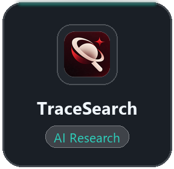
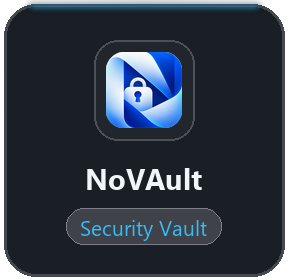
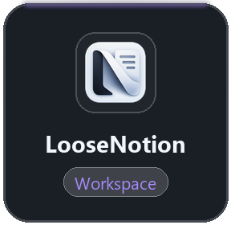
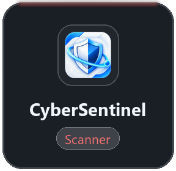
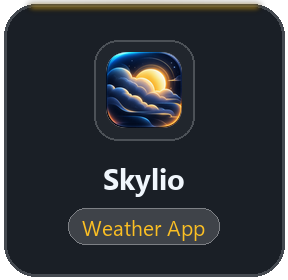
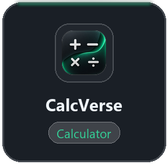

  

   

  

   

  
  &nbsp;
  
  &nbsp;
  
  &nbsp;
  
  &nbsp;
  

 

### ⚡ About

A curious generative-systems engineer and full-stack developer from Kolkata, exploring the intersection of technology, cybersecurity, and creative problem-solving through projects, experiments, and ideas. Drawn to understanding how things work, breaking them apart, and turning concepts into practical products. Always learning, experimenting, and building — with a particular interest in creating things that are useful, thoughtful, and a little different.

---

  <h3>Featured Projects</h3>

   

  
  
  
  
   
  
  
  
  

---

### 🛠️ Technical Arsenal & Skills

#### Languages & Core

  
  
  
  
  
  

#### Frontend Engineering

  
  
  
  
  
  
  

#### Backend & Databases

  
  
  
  
  
  
  
  
  
  

#### Security, DevOps & Infrastructure

  
  
  
  
  
  
  
  
  

---

  <h3>📊 Activity</h3>

  <picture>
    <source media="(prefers-color-scheme: dark)" srcset="https://raw.githubusercontent.com/mizan989/mizan989/output/github-snake-dark.svg" />
    <source media="(prefers-color-scheme: light)" srcset="https://raw.githubusercontent.com/mizan989/mizan989/output/github-snake.svg" />
    
  </picture>

